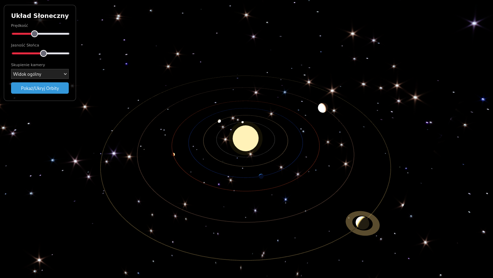
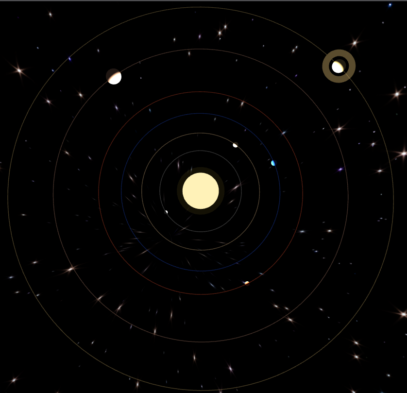
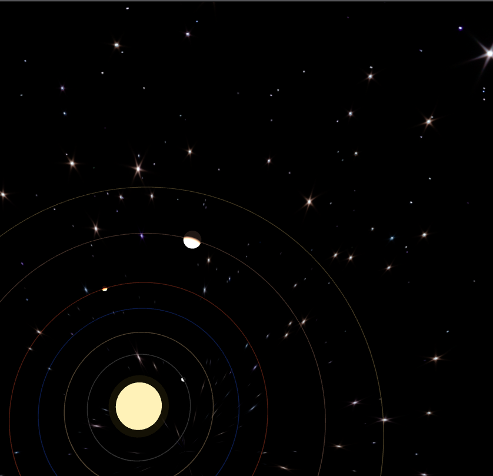
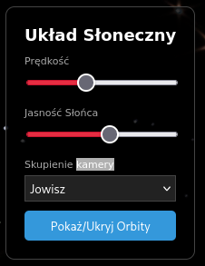
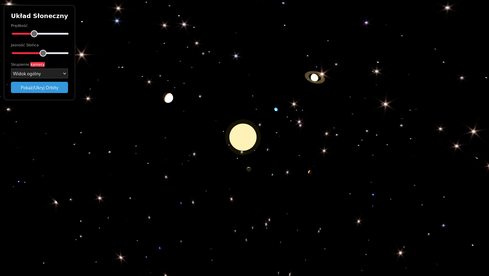
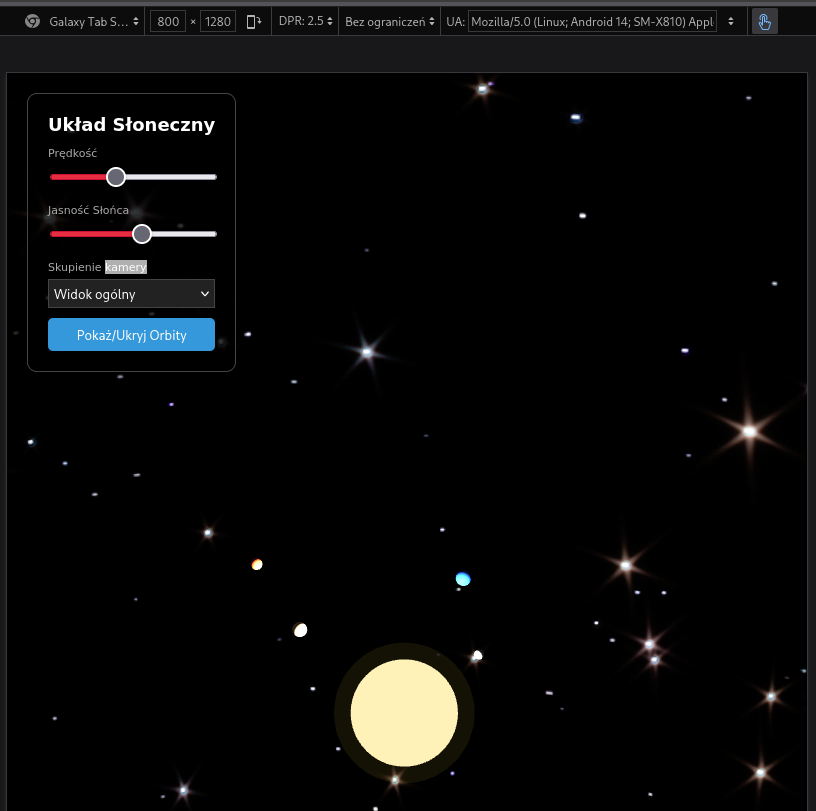

# Dokumentacja Projektu: Układ Słoneczny 3D

## Spis Treści
- [Dokumentacja Projektu: Układ Słoneczny 3D](#dokumentacja-projektu-układ-słoneczny-3d)
  - [Spis Treści](#spis-treści)
  - [1. Wstęp](#1-wstęp)
  - [2. Użyte Technologie](#2-użyte-technologie)
  - [3. Instrukcja Uruchomienia](#3-instrukcja-uruchomienia)
  - [4. Opis Funkcjonalności](#4-opis-funkcjonalności)

## 1. Wstęp
Projekt "Kolorowy Układ Słoneczny 3D" to interaktywna wizualizacja układu słonecznego, stworzona przy użyciu biblioteki Three.js. Aplikacja umożliwia użytkownikom obserwację ruchu planet, zmianę prędkości symulacji, regulację jasności słońca oraz skupienie kamery na wybranej planecie lub słońcu. Projekt jest idealnym przykładem wykorzystania grafiki 3D w przeglądarce do celów edukacyjnych i rozrywkowych.

## 2. Użyte Technologie
*   **HTML5**: Struktura strony.
*   **CSS3**: Stylowanie interfejsu użytkownika.
*   **JavaScript ES6+**: Logika aplikacji.
*   **Three.js**: Biblioteka do tworzenia i wyświetlania grafiki 3D w przeglądarce.
*   **OrbitControls.js**: Rozszerzenie Three.js do obsługi interaktywnej kamery.

## 3. Instrukcja Uruchomienia
1. skopiować scieżke do pliku `index.html`
2. wkleić skopiowaną ścieżke w pasek przeglądarki

## 4. Opis Funkcjonalności
Projekt oferuje następujące funkcje:
*   **Wizualizacja Układu Słonecznego**: Wyświetlanie słońca i sześciu planet (Merkury, Wenus, Ziemia, Mars, Jowisz, Saturn) wraz z ich orbitami. 
    Rys. 1 - Widok ogólny Układu Słonecznego.
    

*   **Interaktywna Kamera**: Użycie `OrbitControls` pozwala na obracanie, przybliżanie i oddalanie widoku sceny za pomocą myszy.
    Rys. 2 - Przykład interakcji z kamerą.
    
    Rys. 3 - Inny widok interakcji z kamerą.
    
*   **Kontrola Prędkości Symulacji**: Suwak na panelu UI umożliwia regulację prędkości, z jaką planety poruszają się po swoich orbitach i obracają wokół własnej osi.
*   **Regulacja Jasności Słońca**: Suwak do zmiany intensywności światła emitowanego przez słońce, wpływając na ogólne oświetlenie sceny.
*   **Skupienie Kamery na Obiekcie**: Rozwijana lista pozwala na wybranie obiektu (Słońce, konkretna planeta lub widok ogólny), na którym kamera automatycznie się skupi i wokół którego będzie się obracać.
    Rys. 4 - Skupienie kamery na planecie.
    
*   **Wizualizacja Orbit**: Przycisk "Pokaż/Ukryj Orbity" kontroluje widoczność linii orbitalnych planet.
    Rys. 5 - Orbity planet widoczne.
    
*   **Responsywny Design**: Scena 3D dostosowuje się do rozmiaru okna przeglądarki.
    Rys. 6 - Responsywny design aplikacji.
    
